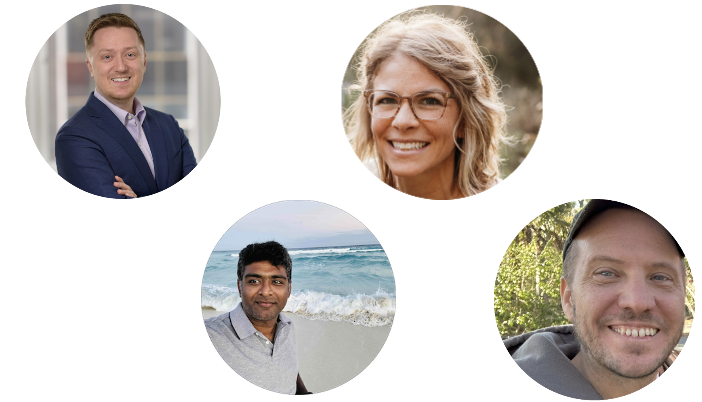

## AI-powered clinical reporting in R with the Pharmaverse

-   Find a seat where you can see the screen!

-   Join the Posit Cloud workspace: [link](https://posit.cloud/spaces/679631/join?access_code=o6j4FZfDKnkiUYDW0g5izzl6qCMQpdsm5RZwk5ay)

-   Join the Slack from [pharmaverse.slack.com/](https://pharmaverse.slack.com/)

-   **WiFI**: Posit Conf 2026 \| `conf2026`

## posit::conf(2026) Things to Know

::: incremental
*  🚻 **Gender-neutral bathroom**: LL2 next to Chicago A

*  🧘 **Meditation/prayer room**: LL2 Chicago A

*  🤱 **Lactation room**: LL2 Chicago B

*  🎉 **Welcome reception**: Tonight 5-7 pm, LL2 Grand Hall West

*  🐠 **Aquarium Night**: Tomorrow 7-10 pm, Georgia Aquarium
:::

## posit::conf(2026) Social Media

* [Red lanyards]{.red .b} available to those who don't wish to be photographed

* `#PositConf2026` for all things conf

## Instructors

::: columns
::: {.column width="70%"}



:::

::: {.column width="30%"}

Daniel Sjoberg<br>

Becca Krouse

<br><br>

Magda Krochmal<br>

Ben X. Straub

:::
:::::


## Your turn!

Who are you?

What do you do?

What do you hope to get out of today?

# Workshop outline

## What to expect from this workshop

-   Learn about what the Pharmaverse is

-   R packages to support Clinical Reporting in R

    -   Create SDTM from raw data (CDASH and non-CDASH formats)

    -   Create ADaM datasets from SDTM

    -   Multiple ways to create tables

    -   Learn about ARDs

-   🤖 See how **AI agents & skills** can accelerate each step

-   Hands-on Exercises & Discussions

## The pipeline, end to end

::: {.pv-flow .pv-flow-accent}
[[📥]{.pv-ico}Raw]{.pv-step}
[[📦]{.pv-ico}SDTM]{.pv-step}
[[🧬]{.pv-ico}ADaM]{.pv-step}
[[📊]{.pv-ico}ARD]{.pv-step}
[[📑]{.pv-ico}TLG]{.pv-step}
:::

<br>

::: {.pv-ai}
[🤖]{.pv-ico} At each stage the pattern repeats — a great fit for an **AI agent**
guided by a **skill** that knows the pharmaverse way.
:::

## Workshop Expectations

:::::: columns
:::: {.column width="70%"}
::: larger
-   Ask questions!

-   Be respectful to each other and yourself
:::
::::

::: {.column width="30%"}

:::
::::::

## Your Background

-   Basic knowledge of R and packages in the tidyverse

-   Basic knowledge of CDISC Standards (ADaM and SDTM Domains)

    -   Check out the [ADaM IG and other documents for CDISC](https://www.cdisc.org/standards/foundational/adam)

    -   Check out [admiral](https://pharmaverse.github.io/admiral/cran-release/) and [admiraldiscovery](https://pharmaverse.github.io/admiraldiscovery/articles/reactable.html) for CDISC implementation

-   🦺 However, CDISC knowledge _not_ required, and you will learn! 🦺


## Welcome to the pharmaverse!

:::::: columns
:::: {.column width="70%"}
::: large
-   <https://pharmaverse.org/>

-   Goals

    -   Align pharma industry on a set of open source packages based in R to deliver the clinical data pipeline

    -   Design, collaborate, and deliver new solutions where suitable tools do not exist
:::
::::

::: {.column width="30%"}

:::
::::::

## E2E Clinical Reporting Packages

<https://pharmaverse.org/e2eclinical/>


## Not that kind of -verse

```{r}
#| error: true
library(pharmaverse)
```

-   The pharmaverse is a collection of open-source tools

-   But we would not want to attempt to load **all of them** at once.

## Industry working on a similar goal

-   Standards (ie CDISC) means standard tools can be created and shared

-   Collaboration in the “post competitive” space means everyone has access to free solutions

-   Team and Regulators seeing consistent packages being used across multiple teams speeds up development and review

# Agents & skills {background-color="#003559"}

## Why AI fits clinical reporting {.smaller}

Clinical programming is full of **standardized, repetitive patterns** —
exactly what AI is good at drafting (and you are good at reviewing).

:::: {.pv-cards}
::: {.pv-card}
[📐]{.pv-ico}
[Standards]{.pv-title}
CDISC gives predictable structure the AI can learn
:::
::: {.pv-card}
[🔁]{.pv-ico}
[Repetition]{.pv-title}
The same mapping patterns recur across variables & domains
:::
::: {.pv-card}
[🧑‍⚖️]{.pv-ico}
[Review culture]{.pv-title}
We already double-check everything — human-in-the-loop by design
:::
::::

## Agent vs. skill {.smaller}

:::: {.pv-cards}
::: {.pv-card}
[🤖]{.pv-ico}
[Agent]{.pv-title}
An AI assistant that can **read your project, run R, and edit code** — not
just chat. It plans and carries out multi-step tasks.
:::
::: {.pv-card .pv-accent}
[🧠]{.pv-ico}
[Skill]{.pv-title}
A **reusable, checked-in instruction set** that teaches the agent *your*
conventions — the pharmaverse way of doing a task.
:::
::::

::: {.pv-flow .pv-flow-accent}
[[🧠]{.pv-ico}Skill = knowledge]{.pv-step}
[[🤖]{.pv-ico}Agent = executor]{.pv-step}
[[👀]{.pv-ico}You = reviewer]{.pv-step}
:::

## One agent, many skills {.smaller}

The same agent, pointed at a different skill, helps at every stage:

::: {.pv-flow}
[[📦]{.pv-ico}SDTM<br>skill]{.pv-step}
[[🧬]{.pv-ico}ADaM<br>skill]{.pv-step}
[[📊]{.pv-ico}ARD<br>skill]{.pv-step}
[[📑]{.pv-ico}TLG<br>skill]{.pv-step}
:::

::: {.pv-ai}
[💡]{.pv-ico} We'll see a concrete **SDTM mapping skill** in the next session —
turning an aCRF into `sdtm.oak` code that you review and run.
:::

## pharmaverse: TRUE or FALSE?


## End-to-End with Barb!

::: columns

::: column
::: {style="text-align: center;"}

:::
:::

::: column
- Yes, she is a cat!

- Yes, she is cute!

- Yes, she is enrolled in the clinical trial we will be walking through today.

- Named after Ben's mother-in-law? Perhaps! 
:::
::::

## End-to-End with Barb!

Barb is on a journey from raw data to the TFLs.
At various points we will be finding Barb in our data as we transform from Raw to TFL.


## End-to-End with Barb!

Barb is on a journey from raw data to the TFLs.
At various points we will be finding Barb in our data as we transform from Raw to TFL.


## End-to-End with Barb!

Barb is on a journey from raw data to the TFLs.
At various points we will be finding Barb in our data as we transform from Raw to TFL.


## End-to-End: The Data


## Working environment

-   For consistency, we will be working in Posit Cloud  

-   Everything has been installed and set up for you 

-   You can also opt to work in local RStudio

-   Following the course, all content from this workshop will be available on the course website and GitHub 


## Quick warm-up

```{r}
#| echo: false
#| cache: false
library(countdown)
countdown(minutes = 5, play_sound = TRUE)
```

-   If using Posit Cloud:

    -   Navigate to Posit Cloud link

    -   Click on the Project to make a personal copy
  
-   If using local RStudio:

    -   Exercises can be found here: https://posit-conf-2026.github.io/pharmaverse/exercises/exercises.html

- Open `exercises/01-intro.R`

- Complete the exercise


## Solution for `00-intro.R`

Using dplyr:
 
- From the ADSL dataset:
- Subset to the safety population (SAFFL == "Y")
- calculate the number of unique subjects in each treatment group (TRT01A)  

```{r}
library(dplyr)

pharmaverseadam::adsl |> 
  filter(SAFFL == "Y") |> 
  count(TRT01A)
```


