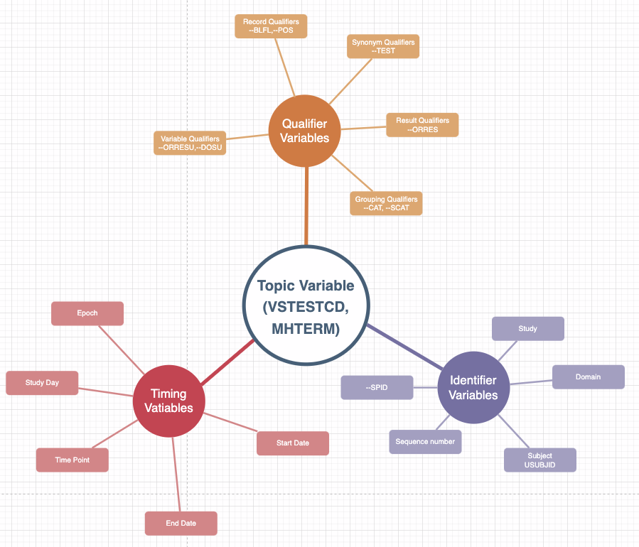

---
title: "CDISC SDTM <br> (Study Data Tabulation Model) <br> datasets in R"
logo: "../../images/pharmaverse-hex.png"
footer: "[https://posit-conf-2026.github.io/pharmaverse/](https://posit-conf-2026.github.io/pharmaverse/)" 
editor: source
engine: knitr
format: 
  revealjs: 
    theme: ../slides.scss
    transition: fade
    slide-number: true
    chalkboard: true
execute:
  echo: true
  freeze: false
cache: false
--- 
```{r}
#| include: false
library(glue)
library(link)
library(sdtm.oak)
library(dplyr)

link::auto(keep_pkg_prefix = FALSE,
           keep_braces = FALSE)

# Package hexes
admiral_img <- "https://raw.githubusercontent.com/pharmaverse/sdtm.oak/master/man/figures/logo.svg"
pharmaverse_img <- "https://raw.githubusercontent.com/pharmaverse/pharmaverse-pkg/master/man/figures/banner.png"
dplyr_img <- "https://raw.githubusercontent.com/tidyverse/dplyr/master/man/figures/logo.png"

# Set image sizes
img_bullet_size <- 80
img_right_size <- 150
img_center_size <- 300
```

## Objectives

By the end of this session you will:

<br>

::::: {.pv-cards}
:::: {.pv-card}
[🧩]{.pv-ico}
[Understand]{.pv-title}
How `sdtm.oak` and its **reusable algorithms** work
::::
:::: {.pv-card}
[⚙️]{.pv-ico}
[Build]{.pv-title}
SDTM `VS` and `DM` domains with live code
::::
:::: {.pv-card}
[🤖]{.pv-ico}
[Accelerate]{.pv-title}
The same mappings with an **AI agent + skill**
::::
:::::

## End to End with Barb!!

<div style="text-align: center;">  </div>

::: {.pv-flow}
[[📥]{.pv-ico}Raw]{.pv-step}
[[📦]{.pv-ico}SDTM]{.pv-step .pv-current}
[[🧬]{.pv-ico}ADaM]{.pv-step}
[[📊]{.pv-ico}ARD]{.pv-step}
[[📑]{.pv-ico}TLG]{.pv-step}
:::

::: {.pv-ai}
[📦]{.pv-ico} Let's cover the **SDTM** step — where Barb's raw data becomes standardized.
:::

## Assumptions

::: incremental
-   Basic knowledge of CDISC Standards (SDTM Domains)
-   Check out the [SDTM IG & other documents](https://www.cdisc.org/standards/foundational/sdtm)
-     🦺 But even lacking CDSIC knowledge, we still think you will gain some great learnings today! 🦺
-   Basic familiarity in R, RStudio IDE and its packages
:::

## Agenda

::: {.pv-flow .pv-flow-tight}
[[📦]{.pv-ico}Intro to `sdtm.oak` · 20 min]{.pv-step}
[[🩺]{.pv-ico}`VS` domain · 20 min]{.pv-step}
[[👤]{.pv-ico}`DM` domain · 10 min]{.pv-step}
[[✏️]{.pv-ico}Exercise · 10 min]{.pv-step}
:::

<br>

::: {.pv-flow .pv-flow-accent}
[[🤖]{.pv-ico}Same work, with an AI agent + skill]{.pv-step}
:::

# Introduction to `sdtm.oak`

## `sdtm.oak` in pharmaverse {.smaller}

:::::: columns
:::: {.column width="60%"}
::: incremental
-   Sponsored by CDISC COSA, pharmaceutical companies, including Roche, Pfizer, GSK, Vertex, Atorus Research, Pattern Institute, Transition Technologies Science.
-   Inspired by the Roche's `roak` package.
-   Addresses a critical gap in the pharmaverse suite by enabling study programmers to create SDTM datasets in R, complementing the existing capabilities for ADaM, TLGs, eSubmission, etc.
:::
::::

::: {.column width="40%"}

:::
::::::

## Challenges in SDTM Programming {.smaller}

::: incremental
-   Although SDTM is simpler with less complex derivations compared to
    ADaM, it presents unique challenges. Unlike ADaM, which uses SDTM
    datasets as its source with a well-defined structure, SDTM relies on
    raw datasets as input.
-   **Raw Data structure** - Different EDC systems produce data in
    different structures, different variable names, dataset names etc.
-   **Varying Data Collection standards** - Although CDASH is available,
    the companies can still develop varying eCRFs using CDASH standards.
:::

## The EDC landscape {.smaller}

Sponsors and CROs collect raw data in **many different systems** — each with
its own data model, export format, and naming conventions.

::::: {.pv-cards}
:::: {.pv-card}
[🗄️]{.pv-ico}
[Medidata Rave]{.pv-title}
Folders / forms / fields; exports as SAS or CSV per form
::::
:::: {.pv-card}
[🗄️]{.pv-ico}
[Oracle InForm]{.pv-title}
Visit → form → itemset hierarchy; its own item OIDs
::::
:::: {.pv-card}
[🗄️]{.pv-ico}
[Veeva CDMS]{.pv-title}
Event / form model; API- and export-driven extracts
::::
:::::

::: {.pv-ai}
[🔌]{.pv-ico} …plus IBM Clinical, OpenClinica, REDCap, paper-to-EDC, external
vendor labs — **`sdtm.oak` doesn't care which one** produced the raw data.
:::

## Same data, different eCRF {.smaller}

The **same vital sign**, collected two different ways:

::::::: {.pv-compare}

:::::: {.pv-panel}
[[🗄️]{.pv-ico} Medidata Rave — dedicated fields]{.pv-panel-head}

::::: {.pv-panel-body}
:::: {.pv-ecrf}
::: {.pv-field}
[Systolic BP]{.pv-label} [120 mmHg]{.pv-input .pv-filled}
:::
::: {.pv-field}
[Position]{.pv-label} [SITTING]{.pv-input .pv-filled}
:::
::::
[One field per test, unit fixed on the form]{.pv-note}
:::::
::::::

:::::: {.pv-panel .pv-panel-b}
[[🗄️]{.pv-ico} Oracle InForm — generic grid]{.pv-panel-head}

::::: {.pv-panel-body}
| Test | Result | Unit |
|------|--------|------|
| SYSBP | 120 | mmHg |
| DIABP | 80 | mmHg |

[Test name is *data*, not a column]{.pv-note}
:::::
::::::

:::::::

::: {.pv-ai}
[👉]{.pv-ico} Same clinical fact → **different variable names, shapes, and units**.
:::

## Same data, different *raw table* {.smaller}

What the programmer actually receives as an export:

::::: {.pv-compare}

:::: {.pv-panel}
[[🗄️]{.pv-ico} Medidata Rave — wide]{.pv-panel-head}

::: {.pv-panel-body}
| SUBJ | SYS_BP | DIA_BP | POS |
|------|--------|--------|-----|
| 1015 | 120 | 80 | SIT |

[Each test is its **own column**]{.pv-note}
:::
::::

:::: {.pv-panel .pv-panel-b}
[[🗄️]{.pv-ico} Oracle InForm — long]{.pv-panel-head}

::: {.pv-panel-body}
| SUBJ | VSTESTCD | VSORRES |
|------|----------|---------|
| 1015 | SYSBP | 120 |
| 1015 | DIABP | 80 |

[Each test is its **own row**]{.pv-note}
:::
::::

:::::

::: {.pv-ai}
[🔑]{.pv-ico} `sdtm.oak` handles both — you map with the same algorithms; only
`raw_var` / `raw_dat` and the id vars change.
:::

## Real raw data: `pharmaverseraw::vs_raw` {.smaller}

The workshop data mimics a real EDC export — note the vendor-specific names:

```{r}
#| echo: true
#| eval: false
names(pharmaverseraw::vs_raw)
#>  [1] "STUDY"  "PATNUM"  "INSTANCE"  "FORM"  "FORML"  "VTLD"
#>  [7] "IT.HEIGHT_VSORRES"  "IT.WEIGHT"  "IT.TEMP"  "IT.TEMP_LOC"
#> [11] "TMPTC"  "SYS_BP"  "DIA_BP"  "PULSE"  "SUBPOS"
```

::::: {.pv-cards}
:::: {.pv-card}
[🏷️]{.pv-ico}
[Item prefixes]{.pv-title}
`IT.` prefix, mixed styles: `SYS_BP` vs `IT.TEMP`
::::
:::: {.pv-card}
[📄]{.pv-ico}
[Vendor columns]{.pv-title}
`INSTANCE`, `FORM`, `VTLD` — not SDTM, EDC metadata
::::
:::: {.pv-card}
[🎯]{.pv-ico}
[Your job]{.pv-title}
Map these → `VS.VSTESTCD`, `VSORRES`, `VSORRESU`, `VSTPT`…
::::
:::::

## CDASH vs a proprietary standard {.smaller}

Even *with* CDASH, sponsors tailor eCRFs — collected values differ.

::::: {.pv-compare}

:::: {.pv-panel}
[[✅]{.pv-ico} CDASH-aligned]{.pv-panel-head}

::: {.pv-panel-body}
| Variable | Collected |
|----------|-----------|
| VSPOS | `SITTING` |
| VSORRESU | `mmHg` |

[Terms already close to CDISC CT]{.pv-note}
:::
::::

:::: {.pv-panel .pv-panel-b}
[[🏢]{.pv-ico} Proprietary]{.pv-panel-head}

::: {.pv-panel-body}
| Variable | Collected |
|----------|-----------|
| POSITION | `Sit` |
| UNIT | `mm Hg` |

[Free-text-ish values → need CT mapping]{.pv-note}
:::
::::

:::::

::: {.pv-ai}
[🔧]{.pv-ico} `assign_ct()` + a **CT spec** reconcile both to the same controlled
term — e.g. `Sit`, `SITTING` → `SITTING`.
:::

## `sdtm.oak` v0.2 {.smaller}

[Available on **CRAN**]{.emphasis}

::::: {.pv-cards}
:::: {.pv-card}
[🔌]{.pv-ico}
[EDC agnostic]{.pv-title}
Handles varying raw structures from different EDC systems & vendors
::::
:::: {.pv-card}
[📐]{.pv-ico}
[Standards agnostic]{.pv-title}
Supports CDASH and proprietary collection standards
::::
:::: {.pv-card}
[🧩]{.pv-ico}
[Modular]{.pv-title}
Composable building blocks for the pharmaverse ecosystem
::::
:::::

# Algorithms

## Key concepts {.smaller}

::: {.pv-flow}
[[📥]{.pv-ico}Collected source data]{.pv-step}
[[🧩]{.pv-ico}Mapping algorithms]{.pv-step}
[[📦]{.pv-ico}Target SDTM model]{.pv-step}
:::

::::: {.pv-cards}
:::: {.pv-card}
[🦴]{.pv-ico}
[The backbone]{.pv-title}
Mapping algorithms are the core of {sdtm.oak}
::::
:::: {.pv-card}
[🔁]{.pv-ico}
[Reusable]{.pv-title}
The same algorithm works across many SDTM domains
::::
:::: {.pv-card}
[🌐]{.pv-ico}
[Language agnostic]{.pv-title}
The concept isn't tied to R — here, each algorithm is an R function
::::
:::::

```{=html}
<style>
.centered-image {
  display: block;
  margin-left: auto;
  margin-right: auto;
  max-width: 100%;
  height: auto;
}
</style>
```
## Reusable Algorithms {.smaller}

Algorithms are **modular building blocks** — compose them to map any domain.

| Algorithm | What it does | Example |
|---|---|---|
| `assign_no_ct()` | One-to-one map, **no** controlled terminology | `AE.AETERM` |
| `assign_ct()` | One-to-one map **with** controlled terminology | `VS.VSPOS` |
| `assign_datetime()` | Map dates/times to ISO 8601 (handles unknowns) | `AE.AEENDTC` |
| `hardcode_ct()` | Hardcode a value **with** controlled terminology | `VS.VSORRESU = 'mmHg'` |
| `hardcode_no_ct()` | Hardcode a value, **no** controlled terminology | `VS.VSCAT = 'VITAL SIGNS'` |
| `condition_add()` | Apply a mapping **only when** a condition holds | `VSMETHOD when VSTESTCD = 'TEMP'` |
| `oak_cal_ref_dates()` | Derive DM reference dates | `DM.RFSTDTC` |

::: {.pv-ai}
[📎]{.pv-ico} Full descriptions for each algorithm are in the **appendix** at the end.
:::

## Algorithms compared to `dplyr`  {.smaller}

::: incremental
- `sdtm.oak` algorithms enhances `dplyr` functions
  - Allowing users to perform multiple actions within a single function call.
  - Applying if_else condtions, Controlled Terminology in a single function call by providing a simple approach compared to case_when statements.
  - Mapping an SDTM variable only if the source contains data, which is particularly useful when hardcoding.
  - Handling unknown dates, as well as date and time collected in separate or the same raw variables.
  - Adding qualifiers to topic variables using oak id variables.
- While all these can be achieved using `dplyr`, the algorithms in `sdtm.oak` provide a more
  elegant and efficient approach.
:::

# sdtm.oak Programming {.smaller}

## Programming concepts {.smaller}

::: incremental
-   Is very close to the key SDTM concepts.
-   Provide a straightforward way to do step-by-step SDTM programming in
    R, that is, mapping topic variable and its qualifiers.
-   Programming steps are generic across SDTM domain classes like
    Events, Interventions, Findings
:::

## SDTM Concept

{.center}

## Programming steps {.smaller}

::: {.pv-steps}
- [1]{.pv-num} [📥]{.pv-ico} Read **raw** datasets
- [2]{.pv-num} [🔑]{.pv-ico} Create **oak id** vars in the raw dataset
- [3]{.pv-num} [📖]{.pv-ico} Read study **controlled terminology**
- [4]{.pv-num} [🎯]{.pv-ico} Map **topic** variable
- [5]{.pv-num} [🏷️]{.pv-ico} Map the **rest** of the variables
- [6]{.pv-num} [🔁]{.pv-ico} Repeat *map topic → map rest* per topic variable
- [7]{.pv-num} [🧮]{.pv-ico} Create SDTM **derived** variables
- [8]{.pv-num} [🏁]{.pv-ico} Add **labels & attributes**
:::

## oak id vars {.smaller}

::: incremental
-   Raw data can be in long format, where each piece of collected data
    is represented as a column.
-   In SDTM mappings, transposing may be necessary to create multiple
    records from a single row in a raw dataset (e.g., HEIGHT and WEIGHT
    in the VS domain).
-   Alternatively, a single row in an SDTM domain can be created from
    one row of the raw dataset (e.g., AETERM from the adverse events raw
    dataset).
-   Qualifiers need to be mapped to their corresponding topic variables.
-   The OAK ID variables are a combination of `patient number`, 
    `row number of the raw dataset`, and `raw source name`.
-   These id variables provide key linkage between the
    SDTM datasets and the raw datasets during programming.
:::

# Workshop - Create VS domain

## How we will "code" today

::: incremental
-   We will walk you through coding `VS` and `DM`
    -   Discussion on each function and function arguments
    -   Check-in Poll
:::

## Review specs

Review aCRF

-  [VitalSigns_aCRF](https://github.com/pharmaverse/pharmaverseraw/blob/main/vignettes/articles/aCRFs/VitalSigns_aCRF.pdf)

## Code Walkthrough

Run the code and explain to the users

## Check in on Barb in Vitals Raw dataset

:::: {.columns}

::: {.column}
<div style="text-align: left;">  </div>
:::

::: {.column}
* PATNUM:  701-1034
* OAK_ID:  213
* INSTANCE: WEEK2
* VTLD: 15-Jul-2014
* TMPTC: after Lying Down for 5 Minutes
* SYS_BP:   183.0
* DIA_BP:   81.0
:::

::::

## Check in on Barb in VS

:::: {.columns}

::: {.column}
<div style="text-align: left;">  </div>
:::

::: {.column}
* USUBJID:  01-701-1034
* VSTESTCD: SYSBP and DIABP
* VISIT: WEEK2
* VSDTC: 2014-07-15
* VSTPT: AFTER LYING DOWN FOR 5 MINUTES
* VSORRES:   183.0 and 81.0
:::

::::

## Quiz - 1

::: incremental
* What function should be used for mapping for CMROUTE. The Route information is collected in a drop down list on the CRF.
  
  * a)  sdtm.oak::assign_no_ct()
  * b)  sdtm.oak::assign_ct()

* Correct answer:
  * b) As CMROUTE has a codelist associated we need to use sdtm.oak::assign_ct()
:::

# Workshop - Create DM domain

## Review specs

Review aCRF

-  [Demographics_aCRF](https://github.com/pharmaverse/pharmaverseraw/blob/main/vignettes/articles/aCRFs/Demographics_aCRF.pdf)
-  [Exposure_as_collected_aCRF](https://github.com/pharmaverse/pharmaverseraw/blob/main/vignettes/articles/aCRFs/Exposure_as_collected_aCRF.pdf)
-  [Subject_Disposition_aCRF](https://github.com/pharmaverse/pharmaverseraw/blob/main/vignettes/articles/aCRFs/Subject_Disposition_aCRF.pdf)

## Reference date derivation

-   DM domain has reference date variables like RFSTDTC, RFENDTC, RFICDTC, RFPENDTC.
-   Usually the programming logic includes deriving this as a minimum or maximum date
    from the raw data across multiple eCRFs.
-   `oak_cal_ref_dates` function can help users derive these reference dates
    based on the metadata provided in a configuration file - `ref_date_config_df`.
-   Users have to prepare this additional metadata file to derive reference dates.

## Reference date configuration file

-   An intuitive way to let {sdtm.oak} know where to look for the reference dates.
-   Multiple eCRFs or raw datasets and variables can be specified to derive a specific
    reference date. The columns in the file are
-   raw_dataset_name : Name of the raw dataset. 
-   date_var : Date variable name from the raw dataset. 
-   time_var : Time variable name from the raw dataset. 
-   dformat : Format of the date collected in raw data. 
-   tformat: Format of the time collected in raw data. 
-   sdtm_var_name : Reference variable name.

## Code Walkthrough

Run the code and explain to the users

## Check in on Barb in Raw dataset

:::: {.columns}

::: {.column}
<div style="text-align: left;">  </div>
:::

::: {.column}
* PATNUM:  701-1034
* OAK_ID:  5
* IT.AGE: 77
* IT.SEX: Female
:::

::::

## Check in on Barb in DM

:::: {.columns}

::: {.column}
<div style="text-align: left;">  </div>
:::

::: {.column}
* USUBJID:  01-701-1034
* AGE:  77
* SEX: FEMALE
:::

::::

## Quiz - 2

::: incremental

* When to use hardcode mapping algorithm?
    * a)  To assign a collected value on the eCRF
    * b)  To Hardcode a SDTM variable that has not directly collected on the eCRF.

* Correct answer:
    * b) To hardcode a value use hardcode algorithms. To assign a
    collected value use assign algorithms**
    
::: 

# Release summary

::: incremental
-   Users can create the majority of the SDTM domains.
-   **Not Supported Domains**\
    Trial Design Domains\
    SV (Subject Visits)\
    SE (Subject Elements)\
    RELREC (Related Records)\
    Associated Person domains.
:::

## Check-in Exercise {.smaller}

Open exercises/02-SDTM.R

```{r, eval = FALSE}
library(sdtm.oak)
library(pharmaverseraw)
library(dplyr)

#AE aCRF - https://github.com/pharmaverse/pharmaverseraw/blob/main/vignettes/articles/aCRFs/AdverseEvent_aCRF.pdf

# Exercise 1: Map AETERM from raw_var=IT.AETERM, tgt_var=AETERM

# Exercise 2:  Map AESER from raw_var=IT.AESER, tgt_var=AESER. Codelist code for AESDTH is C66742

# Exercise 3:  Map AESDTH from raw_var=IT.AESDTH, tgt_var=AESDTH.Annotation text is 
#    If "Yes" then AESDTH = "Y" else Not Submitted. Codelist code for AESDTH is C66742

```

Add the "completed" sticky note to your laptop when complete.

```{r}
#| echo: false
#| cache: false
library(countdown)
countdown::countdown(minutes = 10)
```

## Exercise Solution

```{r, eval = FALSE}
ae <-
  # Derive topic variable
  # Map AETERM using assign_no_ct, raw_var=IT.AETERM, tgt_var=AETERM
  assign_no_ct(
    raw_dat = ae_raw,
    raw_var = "IT.AETERM",
    tgt_var = "AETERM",
    id_vars = oak_id_vars()
  ) %>%
  # Map AESER using assign_no_ct, raw_var=IT.AESER, tgt_var=AESER
  assign_ct(
    raw_dat = ae_raw,
    raw_var = "IT.AESER",
    tgt_var = "AESER",
    ct_spec = study_ct,
    ct_clst = "C66742",
    id_vars = oak_id_vars()
  ) %>%
  # Map AESDTH using condition_add & assign_ct, raw_var=IT.AESDTH, tgt_var=AESDTH
  assign_ct(
    raw_dat = condition_add(ae_raw, IT.AESDTH == "Yes"),
    raw_var = "IT.AESDTH",
    tgt_var = "AESDTH",
    ct_spec = study_ct,
    ct_clst = "C66742",
    id_vars = oak_id_vars()
  )
```


# Doing this with AI {background-color="#003559"}

## From hand-written to AI-assisted {.smaller}

We just wrote every `assign_ct` / `condition_add` call by hand.

::: {.pv-flow .pv-flow-accent}
[[📋]{.pv-ico}aCRF + specs]{.pv-step}
[[🤖]{.pv-ico}AI **agent**]{.pv-step}
[[🧠]{.pv-ico}**skill** = sdtm.oak know-how]{.pv-step}
[[⌨️]{.pv-ico}Generated mapping code]{.pv-step}
[[✅]{.pv-ico}You review & run]{.pv-step}
:::

::: {.pv-speed}
[⏱️ Hours of hand-coding]{.pv-speed-slow} [→]{.pv-speed-arrow} [⚡ Minutes with agent + skill]{.pv-speed-fast}
:::

::: {.pv-ai}
[💡]{.pv-ico} The algorithms are *modular and predictable* — exactly the kind of
repetitive pattern an AI agent can draft, and a human can quickly verify.
:::

## Agent vs. skill {.smaller}

*(Recap from the intro — applied to SDTM)*

::::: {.pv-cards}
:::: {.pv-card}
[🤖]{.pv-ico}
[Agent]{.pv-title}
An AI assistant that can **read your files, run R, and edit code** in your
project — not just chat. It plans and executes multi-step tasks.
::::
:::: {.pv-card .pv-accent}
[🧠]{.pv-ico}
[Skill]{.pv-title}
A **reusable, checked-in instruction set** that teaches the agent *your*
conventions: how to map SDTM with `sdtm.oak`, where specs live, house style.
::::
:::::

::: {.pv-ai}
[🔑]{.pv-ico} Same agent + different skills = SDTM today, ADaM tomorrow, TLGs next.
:::

## What an SDTM skill looks like {.smaller}

A skill is just Markdown + examples the agent loads on demand:

::::: {.pv-skill}

[[🧠]{.pv-ico} skills/sdtm-oak-mapping/SKILL.md]{.pv-skill-head}

:::: {.pv-skill-body}
```markdown
# SDTM mapping with sdtm.oak

Use when: creating an SDTM domain from a raw dataset + aCRF.

Steps
1. Read the aCRF PDF and the domain spec to list target
   variables, their CT codelists, and derivations.
2. For each target variable pick the algorithm:
   - collected, no CT ....... assign_no_ct()
   - collected, with CT ..... assign_ct(ct_spec, ct_clst)
   - hardcoded .............. hardcode_ct() / hardcode_no_ct()
   - conditional ............ wrap raw_dat in condition_add()
   - dates/times ............ assign_datetime()
3. Chain topic then qualifiers with %>%, id_vars = oak_id_vars().
4. Add labels & attributes; run the domain and show a preview.

Conventions: raw vars use IT.<NAME>; CT lives in study_ct.
```
::::
:::::

## Prompt → generated code {.smaller}

::::::: columns

:::::: {.column width="42%"}
::::: {.pv-skill}

[[💬]{.pv-ico} Your prompt]{.pv-skill-head}

:::: {.pv-skill-body}
> "Using the **sdtm-oak-mapping** skill, map **AESER** from
> `IT.AESER` with codelist `C66742`, and **AESDTH** from
> `IT.AESDTH` only when it equals *Yes*."
::::

:::::
::::::

:::::: {.column width="58%"}
```{r, eval = FALSE}
# Agent drafts, following the skill:
ae <- ae_raw |>
  assign_ct(
    raw_var = "IT.AESER", tgt_var = "AESER",
    ct_spec = study_ct, ct_clst = "C66742",
    id_vars = oak_id_vars()
  ) |>
  # condition_add because AESDTH is conditional
  assign_ct(
    raw_dat = condition_add(ae_raw, IT.AESDTH == "Yes"),
    raw_var = "IT.AESDTH", tgt_var = "AESDTH",
    ct_spec = study_ct, ct_clst = "C66742",
    id_vars = oak_id_vars()
  )
```
::::::

:::::::

::: {.pv-ai}
[🧑‍⚖️]{.pv-ico} The agent applied `condition_add()` on its own — **you stay the
reviewer**: check the CT code, run it, confirm Barb looks right.
:::

## Human-in-the-loop {.smaller}

AI drafts the repetitive parts; **you own correctness**.

::: {.pv-steps}
- [1]{.pv-num} [🧠]{.pv-ico} Skill encodes *how* your team maps SDTM
- [2]{.pv-num} [🤖]{.pv-ico} Agent reads specs → drafts `sdtm.oak` code
- [3]{.pv-num} [👀]{.pv-ico} You review: right algorithm? right CT? edge cases?
- [4]{.pv-num} [▶️]{.pv-ico} Run and check the domain (find Barb!)
- [5]{.pv-num} [♻️]{.pv-ico} Refine the skill so the next domain is even faster
:::

::: {.pv-ai}
[⚠️]{.pv-ico} Generated code is a **starting point**, not a submission. Validation,
CT correctness, and traceability remain your responsibility.
:::

## Get Involved

Please try the package and provide us with your feedback, or get
involved in the development of new features. We can be reached through
any of the following means:

Slack: https://oakgarden.slack.com\
GitHub: https://github.com/pharmaverse/sdtm.oak\
CDISC Wiki: https://wiki.cdisc.org/display/oakgarden

## Learning Resources

[sdtm.oak Documentation](https://pharmaverse.github.io/sdtm.oak/)

[Pharmaverse Examples](https://pharmaverse.github.io/examples/)

[sdtm.oak Youtube Video](https://www.youtube.com/watch?v=H0FdhG9_ttU&list=PLMtxz1fUYA5C67SvhSCINluOV2EmyjKql&index=3&ab_channel=RinPharma)

[sdtm.oak Pharmaverse Blog](https://pharmaverse.github.io/blog/posts/2024-10-24_introducing.../introducing_sdtm.oak.html)

[SDTM Programming in R with sdtm.oak Poster](https://phuse.s3.eu-central-1.amazonaws.com/Archive/2025/Connect/US/Orlando/POS_PP31.pdf)

## Thank you


# Appendix — Algorithm Reference {background-color="#003559"}

## assign_no_ct {.smaller}

| Algorithm or Function                         | Description of the Algorithm                                                                                                                              | Example SDTM mapping         |
|---------------------|-----------------------------|----------------------|
| `r link::to_call("sdtm.oak::assign_no_ct()")` | One-to-one mapping between the raw source and a target SDTM variable that has no controlled terminology restrictions. Just a simple assignment statement. | MH.MHTERM <br><br> AE.AETERM |

## assign_ct {.smaller}

| Algorithm or Function                      | Description of the Algorithm                                                                                                                                                                                                                                                      | Example SDTM mapping       |
|---------------------|-----------------------------|----------------------|
| `r link::to_call("sdtm.oak::assign_ct()")` | One-to-one mapping between the raw source and a target SDTM variable that is subject to controlled terminology restrictions. A simple assign statement and applying controlled terminology. This will be used only if the SDTM variable has an associated controlled terminology. | VS.VSPOS <br><br> VS.VSLAT |

## assign_datetime {.smaller}

| Algorithm or Function                            | Description of the Algorithm                                                                                                                                                                                                  | Example SDTM mapping           |
|---------------------|-----------------------------|----------------------|
| `r link::to_call("sdtm.oak::assign_datetime()")` | One-to-one mapping between the raw source and a target that involves mapping a Date or time or datetime component. This mapping algorithm also takes care of handling unknown dates and converting them into. ISO8601 format. | MH.MHSTDTC <br><br> AE.AEENDTC |

## hardcode_ct {.smaller}

| Algorithm or Function                        | Description of the Algorithm                                                                                                                                                           | Example SDTM mapping                           |
|---------------------|-----------------------------|----------------------|
| `r link::to_call("sdtm.oak::hardcode_ct()")` | Mapping a hardcoded value to a target SDTM variable that is subject to terminology restrictions. This will be used only if the SDTM variable has an associated controlled terminology. | MH.MHPRESP = ‘Y’ <br><br> VS.VSORRESU = ‘mmHg’ |

## hardcode_no_ct {.smaller}

| Algorithm or Function                           | Description of the Algorithm                                                              | Example SDTM mapping                                  |
|---------------------|-----------------------------|----------------------|
| `r link::to_call("sdtm.oak::hardcode_no_ct()")` | Mapping a hardcoded value to a target SDTM variable that has no terminology restrictions. | CM.CMTRT = ‘FLUIDS’ <br><br> VS.VSCAT = ‘VITAL SIGNS’ |

## condition_add {.smaller}

| Algorithm or Function                          | Description of the Algorithm                                                                                                                                                                                                                                                                                                                                               | Example SDTM mapping                                                                    |
|---------------------|-----------------------------|----------------------|
| `r link::to_call("sdtm.oak::condition_add()")` | Algorithm that is used to filter the source data and/or target domain based on a condition. The mapping will be applied only if the condition is met. This algorithm has to be used in conjunction with other algorithms, that is if the condition is met perform the mapping using algorithms like assign_ct, assign_no_ct, hardcode_ct, hardcode_no_ct, assign_datetime. | If MDPRIOR == 1 then CM.CMSTRTPT = ‘BEFORE’. <br><br>VS.VSMETHOD when VSTESTCD = ‘TEMP’ |

## oak_cal_ref_dates {.smaller}

| Algorithm or Function                           | Description of the Algorithm                                                              | Example SDTM mapping                                  |
|---------------------|-----------------------------|----------------------|
| `r link::to_call("sdtm.oak::oak_cal_ref_dates()")` | Derivation of Reference dates in the DM domain | DM.RFSTDTC <br><br> DM.RFPENDTC |
