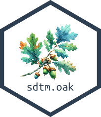

---
title: "CDISC SDTM datasets in R"
subtitle: "Pharmaverse Workshop"
author: "Magdalena Krochmal"
event: "posit::conf(2026)"
logo: "images/sdtmoak-logo.png"
footer: "[Pharmaverse Workshop (posit-conf-2026.github.io/pharmaverse/)](https://posit-conf-2026.github.io/pharmaverse/)"
editor: source
engine: knitr
format: 
  revealjs: 
    theme: ../slides.scss
    template-partials:
      - title-slide.html
    transition: fade
    slide-number: true
    chalkboard: true
execute:
  echo: true
  freeze: false
cache: false
resources:
  - images/pharmaverse-hex.png
--- 
```{r}
#| include: false
library(glue)
library(link)
library(sdtm.oak)
library(dplyr)

# Study controlled terminology used by the live mapping examples
study_ct <- read.csv("metadata/sdtm_ct.csv")

link::auto(keep_pkg_prefix = FALSE,
           keep_braces = FALSE)

# Package hexes
admiral_img <- "https://raw.githubusercontent.com/pharmaverse/sdtm.oak/master/man/figures/logo.svg"
pharmaverse_img <- "https://raw.githubusercontent.com/pharmaverse/pharmaverse-pkg/master/man/figures/banner.png"
dplyr_img <- "https://raw.githubusercontent.com/tidyverse/dplyr/master/man/figures/logo.png"

# Set image sizes
img_bullet_size <- 80
img_right_size <- 150
img_center_size <- 300
```

## Objectives

By the end of this session you will:

<br>

::::: {.pv-cards}
:::: {.pv-card}
[🧩]{.pv-ico}
[Understand]{.pv-title}
How `sdtm.oak` and its **reusable algorithms** work
::::
:::: {.pv-card}
[⚙️]{.pv-ico}
[Build]{.pv-title}
SDTM `VS` and `DM` domains with live code
::::
:::: {.pv-card}
[🤖]{.pv-ico}
[Accelerate]{.pv-title}
The same mappings with an **AI agent + skill**
::::
:::::

## Agenda

::: {.pv-agenda}
::: {.pv-agenda-item}
[📦]{.pv-agenda-ico}
[Intro to `sdtm.oak`]{.pv-agenda-title}
[20 min]{.pv-agenda-time}
:::
::: {.pv-agenda-item}
[🩺]{.pv-agenda-ico}
[`VS` domain]{.pv-agenda-title}
[20 min]{.pv-agenda-time}
:::
::: {.pv-agenda-item}
[👤]{.pv-agenda-ico}
[`DM` domain]{.pv-agenda-title}
[10 min]{.pv-agenda-time}
:::
::: {.pv-agenda-item}
[✏️]{.pv-agenda-ico}
[Exercise]{.pv-agenda-title}
[10 min]{.pv-agenda-time}
:::
:::

::: {.pv-agenda-accent}
[🤖]{.pv-agenda-ico} Same work, accelerated with an **AI agent + skill**
:::

# Introduction to `sdtm.oak`

## `sdtm.oak` in pharmaverse {.smaller}

:::::: columns
:::: {.column width="60%"}
::: incremental
-   Sponsored by CDISC COSA, pharmaceutical companies, including Roche, Pfizer, GSK, Vertex, Atorus Research, Pattern Institute, Transition Technologies Science.
-   Inspired by the Roche's `roak` package.
-   Addresses a critical gap in the pharmaverse suite by enabling study programmers to create SDTM datasets in R, complementing the existing capabilities for ADaM, TLGs, eSubmission, etc.
:::
::::

::: {.column width="40%"}

:::
::::::

## Challenges in SDTM Programming {.smaller}

SDTM maps from **raw data** — so the challenges come from the source.
`sdtm.oak` (on **CRAN**) is designed to meet each one:

::::: {.pv-solve}

:::: {.pv-solve-row}
::: {.pv-solve-key}
🔌 EDC agnostic
:::
::: {.pv-solve-val}
**Raw data structure varies** — different EDC systems use different dataset names, variable names, and structures.
:::
::::

:::: {.pv-solve-row}
::: {.pv-solve-key}
📐 Standards agnostic
:::
::: {.pv-solve-val}
**Collection standards vary** — even with CDASH, sponsors build different eCRFs; proprietary standards are common.
:::
::::

:::: {.pv-solve-row}
::: {.pv-solve-key}
🧩 Modular
:::
::: {.pv-solve-val}
**Mapping is repetitive** — composable algorithms build any domain from the same building blocks.
:::
::::

:::::

## The EDC landscape {.smaller}

Sponsors and CROs collect raw data in **many different systems** — each with its
own data model, export format, and naming conventions.

::: {.pv-badges}
[Medidata Rave]{.pv-badge}
[Oracle InForm]{.pv-badge}
[Veeva CDMS]{.pv-badge}
[IBM Clinical]{.pv-badge}
[OpenClinica]{.pv-badge}
[REDCap]{.pv-badge}
[paper-to-EDC]{.pv-badge}
[vendor labs]{.pv-badge}
:::

They differ in three ways that matter for mapping:

::::: {.pv-solve}
:::: {.pv-solve-row}
::: {.pv-solve-key}
🏷️ Names
:::
::: {.pv-solve-val}
Different variable & dataset names (`SYS_BP` vs `IT.SYSBP`), plus vendor metadata columns.
:::
::::
:::: {.pv-solve-row}
::: {.pv-solve-key}
📐 Shape
:::
::: {.pv-solve-val}
Wide (one column per test) vs long (one row per test).
:::
::::
:::: {.pv-solve-row}
::: {.pv-solve-key}
🔤 Values
:::
::: {.pv-solve-val}
Collected terms vary (`Sit` vs `SITTING`, `mm Hg` vs `mmHg`).
:::
::::
:::::

::: {.pv-ai}
[🔌]{.pv-ico} **`sdtm.oak` doesn't care which system** produced the raw data.
:::

## Same data, many raw shapes — 🏷️ eCRF {.smaller}

*How it's collected — dedicated fields vs a generic grid.*

::::: {.pv-compare}
:::: {.pv-panel}
[[🗄️]{.pv-ico} Medidata Rave — dedicated fields]{.pv-panel-head}

::: {.pv-panel-body}
:::: {.pv-ecrf}
::: {.pv-field}
[Systolic BP]{.pv-label} [120 mmHg]{.pv-input .pv-filled}
:::
::: {.pv-field}
[Position]{.pv-label} [SITTING]{.pv-input .pv-filled}
:::
::::
[One field per test, unit fixed on the form]{.pv-note}
:::
::::

:::: {.pv-panel .pv-panel-b}
[[🗄️]{.pv-ico} Oracle InForm — generic grid]{.pv-panel-head}

::: {.pv-panel-body}
| Test | Result | Unit |
|------|--------|------|
| SYSBP | 120 | mmHg |
| DIABP | 80 | mmHg |

[Test name is *data*, not a column]{.pv-note}
:::
::::
:::::

## Same data, many raw shapes — 📐 Raw table {.smaller}

*What the programmer receives — wide vs long.*

::::: {.pv-compare}
:::: {.pv-panel}
[[🗄️]{.pv-ico} Rave — wide]{.pv-panel-head}

::: {.pv-panel-body}
| SUBJ | SYS_BP | DIA_BP | POS |
|------|--------|--------|-----|
| 1015 | 120 | 80 | SIT |

[Each test is its **own column**]{.pv-note}
:::
::::

:::: {.pv-panel .pv-panel-b}
[[🗄️]{.pv-ico} InForm — long]{.pv-panel-head}

::: {.pv-panel-body}
| SUBJ | VSTESTCD | VSORRES |
|------|----------|---------|
| 1015 | SYSBP | 120 |
| 1015 | DIABP | 80 |

[Each test is its **own row**]{.pv-note}
:::
::::
:::::

## Same data, many raw shapes — 🔤 Standards {.smaller}

*What's stored — CDASH-aligned vs proprietary terms.*

::::: {.pv-compare}
:::: {.pv-panel}
[[✅]{.pv-ico} CDASH-aligned]{.pv-panel-head}

::: {.pv-panel-body}
| Variable | Collected |
|----------|-----------|
| VSPOS | `SITTING` |
| VSORRESU | `mmHg` |

[Terms already close to CDISC CT]{.pv-note}
:::
::::

:::: {.pv-panel .pv-panel-b}
[[🏢]{.pv-ico} Proprietary]{.pv-panel-head}

::: {.pv-panel-body}
| Variable | Collected |
|----------|-----------|
| POSITION | `Sit` |
| UNIT | `mm Hg` |

[Free-text-ish values → need CT mapping]{.pv-note}
:::
::::
:::::

::: {.pv-ai}
[🔑]{.pv-ico} Same algorithms map all of these — only `raw_var` / `raw_dat` change,
and `assign_ct()` + a CT spec reconcile the values (`Sit`, `SITTING` → `SITTING`).
:::

## Real raw data: `pharmaverseraw::vs_raw` {.smaller}

The workshop data mimics a real EDC export — note the vendor-specific names:

```{r}
#| echo: true
#| eval: false
names(pharmaverseraw::vs_raw)
#>  [1] "STUDY"  "PATNUM"  "INSTANCE"  "FORM"  "FORML"  "VTLD"
#>  [7] "IT.HEIGHT_VSORRES"  "IT.WEIGHT"  "IT.TEMP"  "IT.TEMP_LOC"
#> [11] "TMPTC"  "SYS_BP"  "DIA_BP"  "PULSE"  "SUBPOS"
```

::::: {.pv-cards}
:::: {.pv-card}
[🏷️]{.pv-ico}
[Item prefixes]{.pv-title}
`IT.` prefix, mixed styles: `SYS_BP` vs `IT.TEMP`
::::
:::: {.pv-card}
[📄]{.pv-ico}
[Vendor columns]{.pv-title}
`INSTANCE`, `FORM`, `VTLD` — not SDTM, EDC metadata
::::
:::: {.pv-card}
[🎯]{.pv-ico}
[Your job]{.pv-title}
Map these → `VS.VSTESTCD`, `VSORRES`, `VSORRESU`, `VSTPT`…
::::
:::::

# `sdtm.oak`

```{=html}
<style>
.centered-image {
  display: block;
  margin-left: auto;
  margin-right: auto;
  max-width: 100%;
  height: auto;
}
</style>
```

## The SDTM concept {.smaller}

SDTM organizes everything as **observations** about **subjects** — each observation is a **row**, described by **variables**.

::: {.pv-concept}
[[🧍]{.pv-ico} Subject]{.pv-concept-node} [→]{.pv-concept-arrow} [[👀]{.pv-ico} Observation]{.pv-concept-node} [→]{.pv-concept-arrow} [[📊]{.pv-ico} Row of variables]{.pv-concept-node}
:::

> *"Subject **101** had **mild nausea** starting on **study day 6**."*

::::: {.pv-obs}
:::: {.pv-obs-cell .pv-role-id}
[Identifier]{.pv-obs-role}
[101]{.pv-obs-val}
::::
:::: {.pv-obs-cell .pv-role-topic}
[Topic]{.pv-obs-role}
[NAUSEA]{.pv-obs-val}
::::
:::: {.pv-obs-cell .pv-role-timing}
[Timing]{.pv-obs-role}
[Study day 6]{.pv-obs-val}
::::
:::: {.pv-obs-cell .pv-role-qual}
[Qualifier]{.pv-obs-role}
[MILD]{.pv-obs-val}
::::
:::::

## Every variable has a **role** {.smaller}

A variable's *role* determines what it tells you about the observation.

::::: {.pv-roles}
:::: {.pv-role .pv-role-id}
[🆔]{.pv-ico}
[Identifier]{.pv-role-name}
Study, subject, domain, sequence number
::::
:::: {.pv-role .pv-role-topic}
[🎯]{.pv-ico}
[Topic]{.pv-role-name}
The focus of the observation (e.g. the lab test)
::::
:::: {.pv-role .pv-role-timing}
[🕒]{.pv-ico}
[Timing]{.pv-role-name}
When it happened (start / end dates)
::::
:::: {.pv-role .pv-role-qual}
[🏷️]{.pv-ico}
[Qualifier]{.pv-role-name}
Extra detail: results, units, descriptors
::::
:::: {.pv-role .pv-role-rule}
[⚙️]{.pv-ico}
[Rule]{.pv-role-name}
Start / end / branch / loop in Trial Design
::::
:::::

::: {.fragment}
**Qualifiers** carry most of the detail — they split into 5 kinds:

::::: {.pv-cards}
:::: {.pv-card}
[Grouping]{.pv-title}
`--CAT`, `--SCAT`
::::
:::: {.pv-card}
[Result]{.pv-title}
`--ORRES`, `--STRESC`
::::
:::: {.pv-card}
[Synonym]{.pv-title}
`--DECOD`, `--TEST`
::::
:::: {.pv-card}
[Record]{.pv-title}
`AGE`, `SEX`, `--BLFL`
::::
:::: {.pv-card}
[Variable]{.pv-title}
`--ORRESU`, `--DOSU`
::::
:::::
:::

::: {.fragment}
::: {.pv-ai}
[📦]{.pv-ico} A **domain** = related observations with a common topic, one dataset with a 2-char code
prefixing its variables — e.g. **VS** (Vital Signs: `VSTESTCD`, `VSORRES`) and **AE** (Adverse Events: `AETERM`, `AESEV`).
:::
:::

## Reusable algorithms are the **backbone** {.smaller}

::: {.pv-flow}
[[📥]{.pv-ico}Collected source data]{.pv-step}
[[🧩]{.pv-ico}Mapping algorithms]{.pv-step}
[[📦]{.pv-ico}Target SDTM model]{.pv-step}
:::

**Modular building blocks** — reusable across domains, each one an R function you compose to map any domain.

| Algorithm | What it does | Example |
|:----------|:-----------------------------------------|:---------------------|
| `assign_no_ct()` | One-to-one map, **no** controlled terminology | `AE.AETERM` |
| `assign_ct()` | One-to-one map **with** controlled terminology | `VS.VSPOS` |
| `assign_datetime()` | Map dates/times to ISO 8601 (handles unknowns) | `AE.AEENDTC` |
| `hardcode_ct()` | Hardcode a value **with** controlled terminology | `VS.VSORRESU = 'mmHg'` |
| `hardcode_no_ct()` | Hardcode a value, **no** controlled terminology | `VS.VSCAT = 'VITAL SIGNS'` |
| `condition_add()` | Apply a mapping **only when** a condition holds | `VSMETHOD when VSTESTCD = 'TEMP'` |
| `oak_cal_ref_dates()` | Derive DM reference dates | `DM.RFSTDTC` |

::: {.pv-ai}
[📎]{.pv-ico} Full descriptions for each algorithm are in the **appendix** at the end.
:::

## Build a mapping, one algorithm at a time {auto-animate="true"}

```{r}
#| label: 'oak-build-1'
#| output-location: "column"
#| code-line-numbers: "3,4,5,6,7,8,9"
vs_raw <- pharmaverseraw::vs_raw |>
  generate_oak_id_vars(pat_var = "PATNUM", raw_src = "vitals")
vs <-
  # Topic: which test is this row?
  hardcode_ct(
    raw_dat = vs_raw, raw_var = "SYS_BP",
    tgt_var = "VSTESTCD", tgt_val = "SYSBP",
    ct_spec = study_ct, ct_clst = "C66741"
  ) |>
  dplyr::filter(!is.na(VSTESTCD))
vs |> dplyr::select(patient_number, VSTESTCD) |> head(4)
```

::: {.pv-ai}
[🎯]{.pv-ico} Start with the **topic** — `hardcode_ct()` says "these rows are systolic BP".
:::

## Build a mapping, one algorithm at a time {auto-animate="true"}

```{r}
#| label: 'oak-build-2'
#| output-location: "column"
#| code-line-numbers: "11,12,13,14,15"
vs_raw <- pharmaverseraw::vs_raw |>
  generate_oak_id_vars(pat_var = "PATNUM", raw_src = "vitals")
vs <-
  # Topic: which test is this row?
  hardcode_ct(
    raw_dat = vs_raw, raw_var = "SYS_BP",
    tgt_var = "VSTESTCD", tgt_val = "SYSBP",
    ct_spec = study_ct, ct_clst = "C66741"
  ) |>
  dplyr::filter(!is.na(VSTESTCD)) |>
  # Result qualifier: the collected value
  assign_no_ct(
    raw_dat = vs_raw, raw_var = "SYS_BP",
    tgt_var = "VSORRES", id_vars = oak_id_vars()
  )
vs |> dplyr::select(patient_number, VSTESTCD, VSORRES) |> head(4)
```

::: {.pv-ai}
[🏷️]{.pv-ico} Add a **qualifier** — `assign_no_ct()` copies the collected result into `VSORRES`.
:::

## Build a mapping, one algorithm at a time {auto-animate="true"}

```{r}
#| label: 'oak-build-3'
#| output-location: "column"
#| code-line-numbers: "16,17,18,19,20,21"
vs_raw <- pharmaverseraw::vs_raw |>
  generate_oak_id_vars(pat_var = "PATNUM", raw_src = "vitals")
vs <-
  # Topic: which test is this row?
  hardcode_ct(
    raw_dat = vs_raw, raw_var = "SYS_BP",
    tgt_var = "VSTESTCD", tgt_val = "SYSBP",
    ct_spec = study_ct, ct_clst = "C66741"
  ) |>
  dplyr::filter(!is.na(VSTESTCD)) |>
  # Result qualifier: the collected value
  assign_no_ct(
    raw_dat = vs_raw, raw_var = "SYS_BP",
    tgt_var = "VSORRES", id_vars = oak_id_vars()
  ) |>
  # Variable qualifier: the unit
  hardcode_ct(
    raw_dat = vs_raw, raw_var = "SYS_BP",
    tgt_var = "VSORRESU", tgt_val = "mmHg",
    ct_spec = study_ct, ct_clst = "C66770",
    id_vars = oak_id_vars()
  )
vs |> dplyr::select(patient_number, VSTESTCD, VSORRES, VSORRESU) |> head(4)
```

::: {.pv-ai}
[🔁]{.pv-ico} Same **pattern**, one algorithm per variable — chain as many as the domain needs.
:::

## Algorithms vs. plain `dplyr` {.smaller}

One `sdtm.oak` call does what several `dplyr` steps would.

::::: columns

:::: {.column width="50%"}
🧰 **plain dplyr**

```r
vs_raw |>
  mutate(
    VSPOS = case_when(
      SUBPOS == "STANDING" ~ "STANDING",
      SUBPOS == "SITTING"  ~ "SITTING",
      TRUE ~ NA_character_
    )
  )
# + separate join to apply CT
# + manual oak id bookkeeping
```
::::

:::: {.column width="50%"}
🌳 **sdtm.oak**

```r
vs_raw |>
  assign_ct(
    raw_var  = "SUBPOS",
    tgt_var  = "VSPOS",
    ct_spec  = study_ct,
    ct_clst  = "C71148",
    id_vars  = oak_id_vars()
  )
# CT + id linkage handled for you
```
::::

:::::

::: {.pv-ai}
[⚡]{.pv-ico} Mapping, controlled terminology, conditions, and oak id linkage collapse into **one call**.
:::

## oak id vars — the linkage key {.smaller}

Raw data is **long**: each collected item is a column. `sdtm.oak` needs to know
which SDTM record each qualifier belongs to.

::::: {.pv-idmap}
:::: {.pv-idmap-side}
[Raw row]{.pv-idmap-head}
[patient `701-1015`]{.pv-idmap-cell}
[row `5`]{.pv-idmap-cell}
[source `vitals`]{.pv-idmap-cell}
::::
:::: {.pv-idmap-conn}
[🔑]{.pv-idmap-key}
::::
:::: {.pv-idmap-side}
[oak id vars]{.pv-idmap-head}
[`patient_number`]{.pv-idmap-cell}
[`oak_id`]{.pv-idmap-cell}
[`raw_source`]{.pv-idmap-cell}
::::
:::: {.pv-idmap-conn}
[→]{.pv-idmap-arrow}
::::
:::: {.pv-idmap-side .pv-idmap-target}
[SDTM records]{.pv-idmap-head}
[VSTESTCD = SYSBP]{.pv-idmap-cell}
[VSORRES = 131]{.pv-idmap-cell}
[VSORRESU = mmHg]{.pv-idmap-cell}
::::
:::::

::: {.pv-ai}
[🔗]{.pv-ico} `patient_number` + `oak_id` (raw row) + `raw_source` uniquely tie every
qualifier back to its topic — and the SDTM record back to the raw dataset.
:::

## Programming steps {.smaller}

::::::: columns

:::::: {.column width="42%"}
::: {.pv-steps}
- [1]{.pv-num} [📥]{.pv-ico} [Read **raw** datasets]{.fragment fragment-index=0}
- [2]{.pv-num} [🔑]{.pv-ico} [Create **oak id** vars]{.fragment fragment-index=0}
- [3]{.pv-num} [📖]{.pv-ico} [Read study **CT**]{.fragment fragment-index=1}
- [4]{.pv-num} [🎯]{.pv-ico} [Map **topic** variable]{.fragment fragment-index=2}
- [5]{.pv-num} [🏷️]{.pv-ico} [Map the **rest**]{.fragment fragment-index=2}
- [6]{.pv-num} [🔁]{.pv-ico} [Repeat per topic variable]{.fragment fragment-index=2}
- [7]{.pv-num} [🧮]{.pv-ico} [Create **derived** vars]{.fragment fragment-index=3}
- [8]{.pv-num} [🏁]{.pv-ico} [Add **labels & attributes**]{.fragment fragment-index=3}
:::
::::::

:::::: {.column width="58%"}
```{.r code-line-numbers="|1-3|4-5|6-11|12-15"}
# 1-2  read raw + create oak id vars
vs_raw <- pharmaverseraw::vs_raw |>
  generate_oak_id_vars(pat_var = "PATNUM", raw_src = "vitals")
# 3  read study controlled terminology
study_ct <- read.csv("sdtm_ct.csv")
# 4-6  map topic, map rest, repeat per topic var
vs <- hardcode_ct(vs_raw, "SYS_BP",
        tgt_var = "VSTESTCD", tgt_val = "SYSBP",
        ct_spec = study_ct, ct_clst = "C66741") |>
  assign_no_ct(vs_raw, "SYS_BP",
        tgt_var = "VSORRES", id_vars = oak_id_vars())
# 7-8  derived vars + labels & attributes
vs <- vs |>
  derive_seq(tgt_var = "VSSEQ", ...) |>
  derive_study_day(...)
```
::::::

:::::::

# Workshop - Create VS domain

## How we will "code" today

::: incremental
-   We will walk you through coding `VS` and `DM`
    -   Discussion on each function and function arguments
    -   Check-in Poll
:::

## Review specs

Review aCRF

-  [VitalSigns_aCRF](https://github.com/pharmaverse/pharmaverseraw/blob/main/vignettes/articles/aCRFs/VitalSigns_aCRF.pdf)

## Check in on Barb — Vitals raw → VS {.smaller}

:::: {.columns}

::: {.column width="20%"}
<div style="text-align: left;">  </div>
:::

::: {.column width="40%"}
**Vitals raw**

* PATNUM:  701-1034
* OAK_ID:  213
* INSTANCE: WEEK2
* VTLD: 15-Jul-2014
* TMPTC: after Lying Down for 5 Minutes
* SYS_BP:   183.0
* DIA_BP:   81.0
:::

::: {.column width="40%"}
**VS domain**

* USUBJID:  01-701-1034
* VSTESTCD: SYSBP and DIABP
* VISIT: WEEK2
* VSDTC: 2014-07-15
* VSTPT: AFTER LYING DOWN FOR 5 MINUTES
* VSORRES:   183.0 and 81.0
:::

::::

## Quiz - 1

::: incremental
* What function should be used for mapping for CMROUTE. The Route information is collected in a drop down list on the CRF.
  
  * a)  sdtm.oak::assign_no_ct()
  * b)  sdtm.oak::assign_ct()

* Correct answer:
  * b) As CMROUTE has a codelist associated we need to use sdtm.oak::assign_ct()
:::

# Workshop - Create DM domain

## Review specs

Review aCRF

-  [Demographics_aCRF](https://github.com/pharmaverse/pharmaverseraw/blob/main/vignettes/articles/aCRFs/Demographics_aCRF.pdf)
-  [Exposure_as_collected_aCRF](https://github.com/pharmaverse/pharmaverseraw/blob/main/vignettes/articles/aCRFs/Exposure_as_collected_aCRF.pdf)
-  [Subject_Disposition_aCRF](https://github.com/pharmaverse/pharmaverseraw/blob/main/vignettes/articles/aCRFs/Subject_Disposition_aCRF.pdf)

## Reference date derivation

-   DM domain has reference date variables like RFSTDTC, RFENDTC, RFICDTC, RFPENDTC.
-   Usually the programming logic includes deriving this as a minimum or maximum date
    from the raw data across multiple eCRFs.
-   `oak_cal_ref_dates` function can help users derive these reference dates
    based on the metadata provided in a configuration file - `ref_date_config_df`.
-   Users have to prepare this additional metadata file to derive reference dates.

## Reference date configuration file

-   An intuitive way to let {sdtm.oak} know where to look for the reference dates.
-   Multiple eCRFs or raw datasets and variables can be specified to derive a specific
    reference date. The columns in the file are
-   raw_dataset_name : Name of the raw dataset. 
-   date_var : Date variable name from the raw dataset. 
-   time_var : Time variable name from the raw dataset. 
-   dformat : Format of the date collected in raw data. 
-   tformat: Format of the time collected in raw data. 
-   sdtm_var_name : Reference variable name.

## Check in on Barb — DM raw → DM {.smaller}

:::: {.columns}

::: {.column width="20%"}
<div style="text-align: left;">  </div>
:::

::: {.column width="40%"}
**DM raw**

* PATNUM:  701-1034
* OAK_ID:  5
* IT.AGE: 77
* IT.SEX: Female
:::

::: {.column width="40%"}
**DM domain**

* USUBJID:  01-701-1034
* AGE:  77
* SEX: FEMALE
:::

::::

## Quiz - 2

::: incremental

* When to use hardcode mapping algorithm?
    * a)  To assign a collected value on the eCRF
    * b)  To Hardcode a SDTM variable that has not directly collected on the eCRF.

* Correct answer:
    * b) To hardcode a value use hardcode algorithms. To assign a
    collected value use assign algorithms**
    
::: 

## Check-in Exercise {.smaller}

Open exercises/02-SDTM.R

```{r, eval = FALSE}
library(sdtm.oak)
library(pharmaverseraw)
library(dplyr)

#AE aCRF - https://github.com/pharmaverse/pharmaverseraw/blob/main/vignettes/articles/aCRFs/AdverseEvent_aCRF.pdf

# Exercise 1: Map AETERM from raw_var=IT.AETERM, tgt_var=AETERM

# Exercise 2:  Map AESER from raw_var=IT.AESER, tgt_var=AESER. Codelist code for AESDTH is C66742

# Exercise 3:  Map AESDTH from raw_var=IT.AESDTH, tgt_var=AESDTH.Annotation text is 
#    If "Yes" then AESDTH = "Y" else Not Submitted. Codelist code for AESDTH is C66742

```

Add the "completed" sticky note to your laptop when complete.

```{r}
#| echo: false
#| cache: false
library(countdown)
countdown::countdown(minutes = 10)
```

## Exercise Solution

```{r, eval = FALSE}
ae <-
  # Derive topic variable
  # Map AETERM using assign_no_ct, raw_var=IT.AETERM, tgt_var=AETERM
  assign_no_ct(
    raw_dat = ae_raw,
    raw_var = "IT.AETERM",
    tgt_var = "AETERM",
    id_vars = oak_id_vars()
  ) %>%
  # Map AESER using assign_no_ct, raw_var=IT.AESER, tgt_var=AESER
  assign_ct(
    raw_dat = ae_raw,
    raw_var = "IT.AESER",
    tgt_var = "AESER",
    ct_spec = study_ct,
    ct_clst = "C66742",
    id_vars = oak_id_vars()
  ) %>%
  # Map AESDTH using condition_add & assign_ct, raw_var=IT.AESDTH, tgt_var=AESDTH
  assign_ct(
    raw_dat = condition_add(ae_raw, IT.AESDTH == "Yes"),
    raw_var = "IT.AESDTH",
    tgt_var = "AESDTH",
    ct_spec = study_ct,
    ct_clst = "C66742",
    id_vars = oak_id_vars()
  )
```


# Doing this with AI {background-color="#003559"}

## From hand-written to AI-assisted {.smaller}

We just wrote every `assign_ct` / `condition_add` call by hand.

::: {.pv-flow .pv-flow-accent}
[[📋]{.pv-ico}aCRF + specs]{.pv-step}
[[🤖]{.pv-ico}AI **agent**]{.pv-step}
[[🧠]{.pv-ico}**skill** = sdtm.oak know-how]{.pv-step}
[[⌨️]{.pv-ico}Generated mapping code]{.pv-step}
[[✅]{.pv-ico}You review & run]{.pv-step}
:::

::: {.pv-speed}
[⏱️ Hours of hand-coding]{.pv-speed-slow} [→]{.pv-speed-arrow} [⚡ Minutes with agent + skill]{.pv-speed-fast}
:::

::: {.pv-ai}
[💡]{.pv-ico} The algorithms are *modular and predictable* — exactly the kind of
repetitive pattern an AI agent can draft, and a human can quickly verify.
:::

## Agent vs. skill {.smaller}

*(Recap from the intro — applied to SDTM)*

::::: {.pv-cards}
:::: {.pv-card}
[🤖]{.pv-ico}
[Agent]{.pv-title}
An AI assistant that can **read your files, run R, and edit code** in your
project — not just chat. It plans and executes multi-step tasks.
::::
:::: {.pv-card .pv-accent}
[🧠]{.pv-ico}
[Skill]{.pv-title}
A **reusable, checked-in instruction set** that teaches the agent *your*
conventions: how to map SDTM with `sdtm.oak`, where specs live, house style.
::::
:::::

::: {.pv-ai}
[🔑]{.pv-ico} Same agent + different skills = SDTM today, ADaM tomorrow, TLGs next.
:::

## What an SDTM skill looks like {.smaller}

A skill is just Markdown + examples the agent loads on demand:

::::: {.pv-skill}

[[🧠]{.pv-ico} skills/sdtm-oak-mapping/SKILL.md]{.pv-skill-head}

:::: {.pv-skill-body}
```markdown
# SDTM mapping with sdtm.oak

Use when: creating an SDTM domain from a raw dataset + aCRF.

Steps
1. Read the aCRF PDF and the domain spec to list target
   variables, their CT codelists, and derivations.
2. For each target variable pick the algorithm:
   - collected, no CT ....... assign_no_ct()
   - collected, with CT ..... assign_ct(ct_spec, ct_clst)
   - hardcoded .............. hardcode_ct() / hardcode_no_ct()
   - conditional ............ wrap raw_dat in condition_add()
   - dates/times ............ assign_datetime()
3. Chain topic then qualifiers with %>%, id_vars = oak_id_vars().
4. Add labels & attributes; run the domain and show a preview.

Conventions: raw vars use IT.<NAME>; CT lives in study_ct.
```
::::
:::::

## Prompt → generated code {.smaller}

::::::: columns

:::::: {.column width="42%"}
::::: {.pv-skill}

[[💬]{.pv-ico} Your prompt]{.pv-skill-head}

:::: {.pv-skill-body}
> "Using the **sdtm-oak-mapping** skill, map **AESER** from
> `IT.AESER` with codelist `C66742`, and **AESDTH** from
> `IT.AESDTH` only when it equals *Yes*."
::::

:::::
::::::

:::::: {.column width="58%"}
```{r, eval = FALSE}
# Agent drafts, following the skill:
ae <- ae_raw |>
  assign_ct(
    raw_var = "IT.AESER", tgt_var = "AESER",
    ct_spec = study_ct, ct_clst = "C66742",
    id_vars = oak_id_vars()
  ) |>
  # condition_add because AESDTH is conditional
  assign_ct(
    raw_dat = condition_add(ae_raw, IT.AESDTH == "Yes"),
    raw_var = "IT.AESDTH", tgt_var = "AESDTH",
    ct_spec = study_ct, ct_clst = "C66742",
    id_vars = oak_id_vars()
  )
```
::::::

:::::::

::: {.pv-ai}
[🧑‍⚖️]{.pv-ico} The agent applied `condition_add()` on its own — **you stay the
reviewer**: check the CT code, run it, confirm Barb looks right.
:::

## Human-in-the-loop {.smaller}

AI drafts the repetitive parts; **you own correctness**.

::: {.pv-steps}
- [1]{.pv-num} [🧠]{.pv-ico} Skill encodes *how* your team maps SDTM
- [2]{.pv-num} [🤖]{.pv-ico} Agent reads specs → drafts `sdtm.oak` code
- [3]{.pv-num} [👀]{.pv-ico} You review: right algorithm? right CT? edge cases?
- [4]{.pv-num} [▶️]{.pv-ico} Run and check the domain (find Barb!)
- [5]{.pv-num} [♻️]{.pv-ico} Refine the skill so the next domain is even faster
:::

::: {.pv-ai}
[⚠️]{.pv-ico} Generated code is a **starting point**, not a submission. Validation,
CT correctness, and traceability remain your responsibility.
:::

## Wrap-up & resources {.smaller}

:::::: {.pv-wrap}
::::: {.pv-wrap-row}
:::: {.pv-wrap-ico}
✅
::::
::: {.pv-wrap-body}
[What you can build]{.pv-wrap-title}
Most SDTM domains today. *Not yet:* Trial Design, SV, SE, RELREC, Associated Persons.
:::
:::::
::::: {.pv-wrap-row .pv-wrap-accent}
:::: {.pv-wrap-ico}
🤝
::::
::: {.pv-wrap-body}
[Get involved]{.pv-wrap-title}
[💬 Slack](https://oakgarden.slack.com) · [🐙 GitHub](https://github.com/pharmaverse/sdtm.oak) · [📖 CDISC Wiki](https://wiki.cdisc.org/display/oakgarden)
:::
:::::
::::: {.pv-wrap-row}
:::: {.pv-wrap-ico}
📚
::::
::: {.pv-wrap-body}
[Learn more]{.pv-wrap-title}
[📄 Docs](https://pharmaverse.github.io/sdtm.oak/) · [🧩 Examples](https://pharmaverse.github.io/examples/) · [▶️ Video](https://www.youtube.com/watch?v=H0FdhG9_ttU&list=PLMtxz1fUYA5C67SvhSCINluOV2EmyjKql&index=3&ab_channel=RinPharma) · [📝 Blog](https://pharmaverse.github.io/blog/posts/2024-10-24_introducing.../introducing_sdtm.oak.html) · [📊 Poster](https://phuse.s3.eu-central-1.amazonaws.com/Archive/2025/Connect/US/Orlando/POS_PP31.pdf)
:::
:::::
::::::

## Acknowledgements {.smaller}

::: {.ack-hero}

:::

The `sdtm.oak` package is the work of many contributors:

::: {.ack-grid}
::: {.ack-card .ack-lead}
[Rammprasad Ganapathy]{.ack-name}
[Lead Author]{.ack-role}
:::
::: {.ack-card}
[Adam Forys]{.ack-name}
[Author]{.ack-role}
:::
::: {.ack-card}
[Edgar Manukyan]{.ack-name}
[Author]{.ack-role}
:::
::: {.ack-card}
[Rosemary Li]{.ack-name}
[Author]{.ack-role}
:::
::: {.ack-card}
[Preetesh Parikh]{.ack-name}
[Author]{.ack-role}
:::
::: {.ack-card}
[Lisa Houterloot]{.ack-name}
[Author]{.ack-role}
:::
::: {.ack-card}
[Yogesh Gupta]{.ack-name}
[Author]{.ack-role}
:::
::: {.ack-card}
[Omar Garcia]{.ack-name}
[Author]{.ack-role}
:::
::: {.ack-card}
[Ramiro Magno]{.ack-name}
[Author]{.ack-role}
:::
::: {.ack-card}
[Kamil Sijko]{.ack-name}
[Author]{.ack-role}
:::
::: {.ack-card}
[Shiyu Chen]{.ack-name}
[Author]{.ack-role}
:::
:::

## Thank you


# Appendix — Algorithm Reference {background-color="#003559"}

## assign_no_ct {.smaller}

| Algorithm or Function                         | Description of the Algorithm                                                                                                                              | Example SDTM mapping         |
|---------------------|-----------------------------|----------------------|
| `r link::to_call("sdtm.oak::assign_no_ct()")` | One-to-one mapping between the raw source and a target SDTM variable that has no controlled terminology restrictions. Just a simple assignment statement. | MH.MHTERM <br><br> AE.AETERM |

## assign_ct {.smaller}

| Algorithm or Function                      | Description of the Algorithm                                                                                                                                                                                                                                                      | Example SDTM mapping       |
|---------------------|-----------------------------|----------------------|
| `r link::to_call("sdtm.oak::assign_ct()")` | One-to-one mapping between the raw source and a target SDTM variable that is subject to controlled terminology restrictions. A simple assign statement and applying controlled terminology. This will be used only if the SDTM variable has an associated controlled terminology. | VS.VSPOS <br><br> VS.VSLAT |

## assign_datetime {.smaller}

| Algorithm or Function                            | Description of the Algorithm                                                                                                                                                                                                  | Example SDTM mapping           |
|---------------------|-----------------------------|----------------------|
| `r link::to_call("sdtm.oak::assign_datetime()")` | One-to-one mapping between the raw source and a target that involves mapping a Date or time or datetime component. This mapping algorithm also takes care of handling unknown dates and converting them into. ISO8601 format. | MH.MHSTDTC <br><br> AE.AEENDTC |

## hardcode_ct {.smaller}

| Algorithm or Function                        | Description of the Algorithm                                                                                                                                                           | Example SDTM mapping                           |
|---------------------|-----------------------------|----------------------|
| `r link::to_call("sdtm.oak::hardcode_ct()")` | Mapping a hardcoded value to a target SDTM variable that is subject to terminology restrictions. This will be used only if the SDTM variable has an associated controlled terminology. | MH.MHPRESP = ‘Y’ <br><br> VS.VSORRESU = ‘mmHg’ |

## hardcode_no_ct {.smaller}

| Algorithm or Function                           | Description of the Algorithm                                                              | Example SDTM mapping                                  |
|---------------------|-----------------------------|----------------------|
| `r link::to_call("sdtm.oak::hardcode_no_ct()")` | Mapping a hardcoded value to a target SDTM variable that has no terminology restrictions. | CM.CMTRT = ‘FLUIDS’ <br><br> VS.VSCAT = ‘VITAL SIGNS’ |

## condition_add {.smaller}

| Algorithm or Function                          | Description of the Algorithm                                                                                                                                                                                                                                                                                                                                               | Example SDTM mapping                                                                    |
|---------------------|-----------------------------|----------------------|
| `r link::to_call("sdtm.oak::condition_add()")` | Algorithm that is used to filter the source data and/or target domain based on a condition. The mapping will be applied only if the condition is met. This algorithm has to be used in conjunction with other algorithms, that is if the condition is met perform the mapping using algorithms like assign_ct, assign_no_ct, hardcode_ct, hardcode_no_ct, assign_datetime. | If MDPRIOR == 1 then CM.CMSTRTPT = ‘BEFORE’. <br><br>VS.VSMETHOD when VSTESTCD = ‘TEMP’ |

## oak_cal_ref_dates {.smaller}

| Algorithm or Function                           | Description of the Algorithm                                                              | Example SDTM mapping                                  |
|---------------------|-----------------------------|----------------------|
| `r link::to_call("sdtm.oak::oak_cal_ref_dates()")` | Derivation of Reference dates in the DM domain | DM.RFSTDTC <br><br> DM.RFPENDTC |
