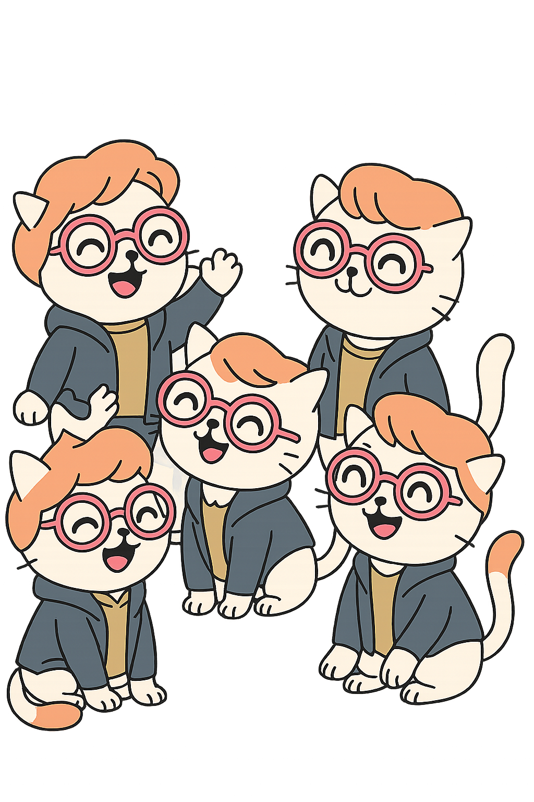

# Thank you for being here!

## Remember...

The success of Pharmaverse and Open Source relies on the community! 

{fig-align="center"}

## How to contribute

- Use the packages 

- Write blogs, create templates

- Submit Issues and/or Code

  - documentation 
  
  - feature requests
  
  - Bug
  
- Join as a contributor – get in touch with the maintainer

All types of contributions are welcome!

## Post-workshop Survey

- Your feedback is crucial! 

- Data from the survey informs curriculum and format decisions for future conf workshops, and we really appreciate you taking the time to provide it

- Link: [http://pos.it/conf-workshop-survey](http://pos.it/conf-workshop-survey)
