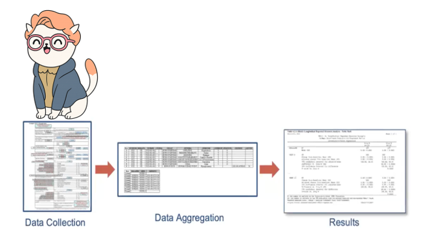
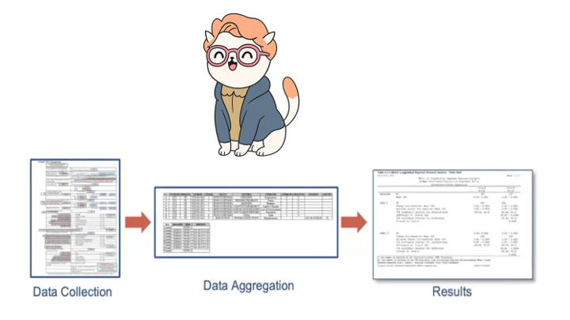
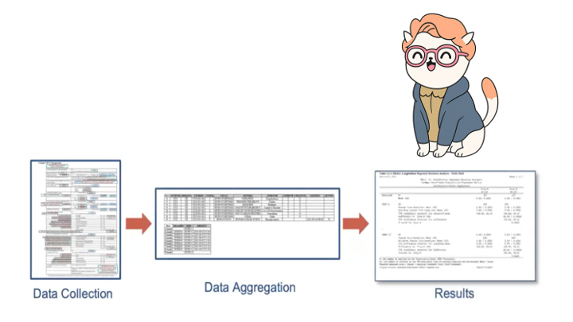

# Recap time!

## End-to-End with One Subject

Subject `01-701-1015` went on a journey from raw data to TFLs.
At various points we can trace that same subject as we transformed from Raw to TFL.

## End-to-End with One Subject

Subject `01-701-1015` went on a journey from raw data to TFLs.
At various points we can trace that same subject as we transformed from Raw to TFL.

## End-to-End with One Subject

Subject `01-701-1015` went on a journey from raw data to TFLs.
At various points we can trace that same subject as we transformed from Raw to TFL.

## What did we cover?

::: {.incremental}

- Raw to SDTM with {sdtm.oak}

- SDTM to ADaM with {admiral}, {metacore}, {metatools}, {xportr}

- ARDs with {cards} and {cardx}

- ARD-friendly tables with {gtsummary}

- ARD-first tables with {tfrmt}

:::
